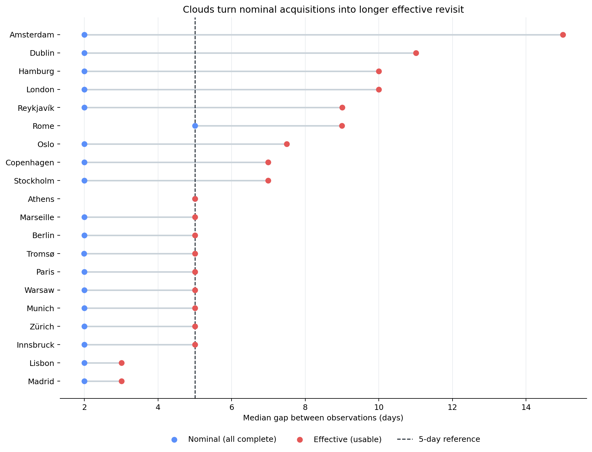
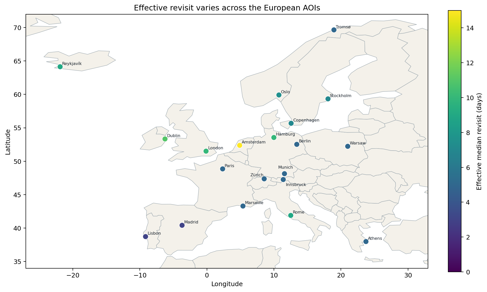
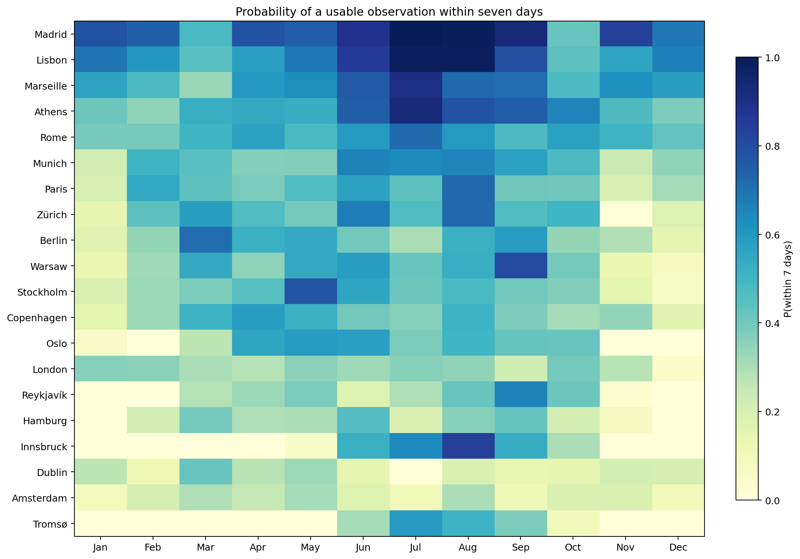
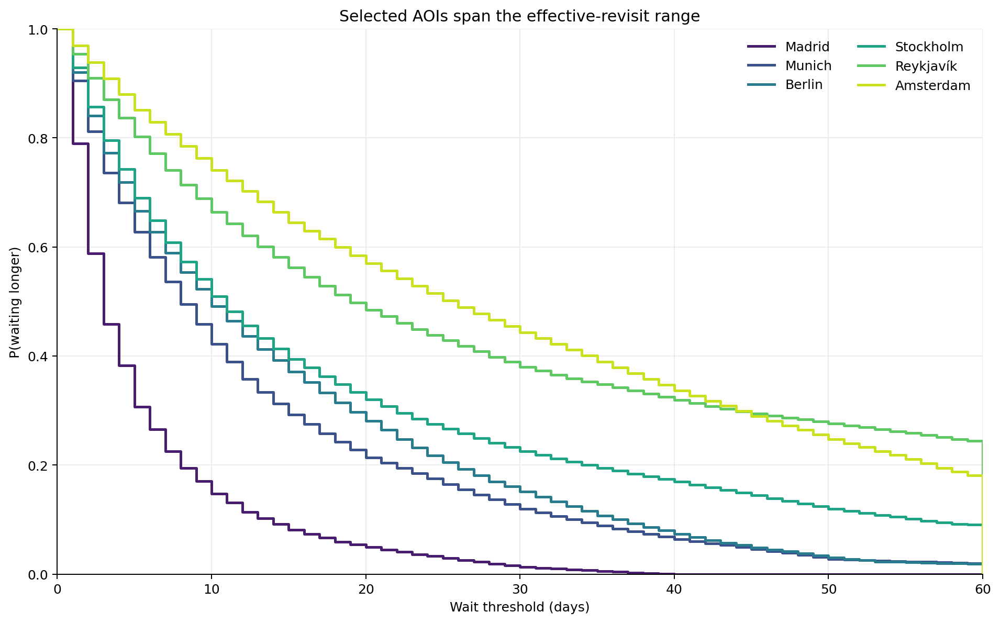
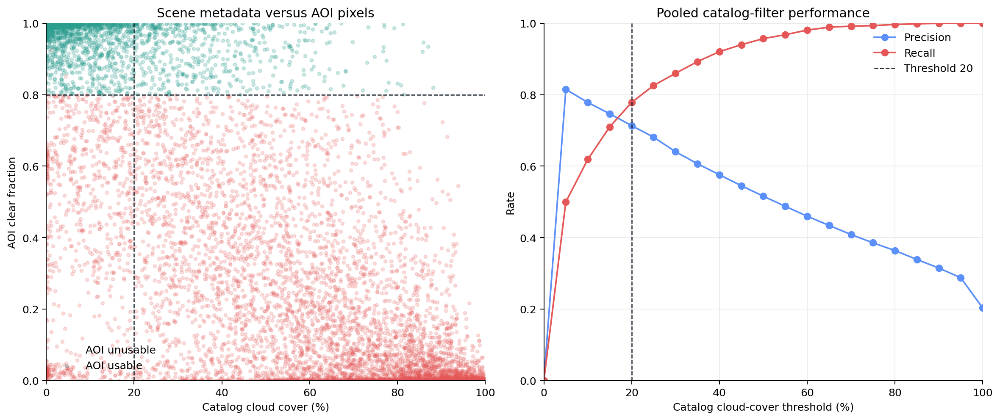
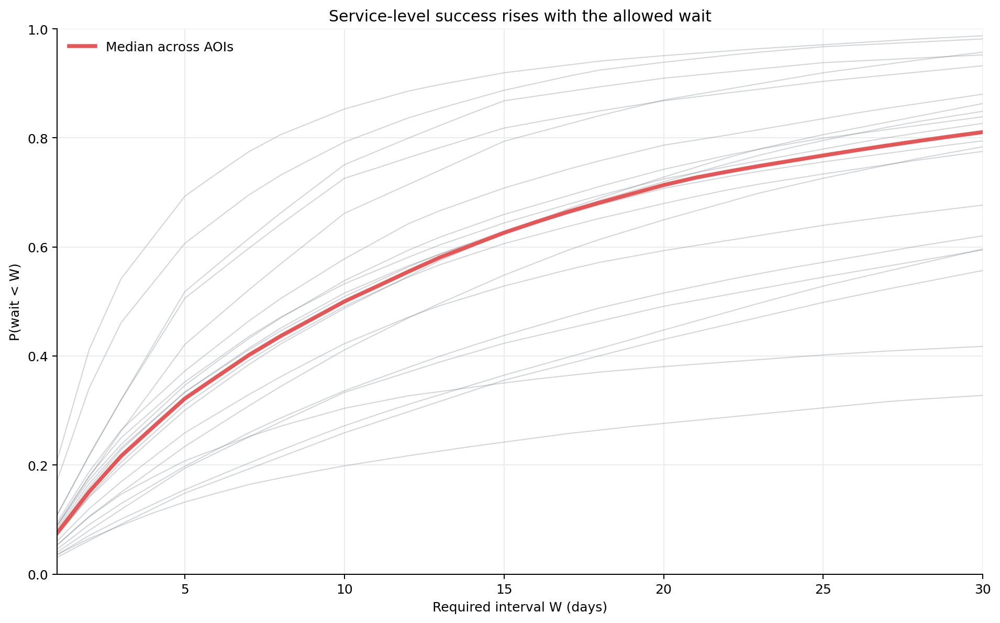
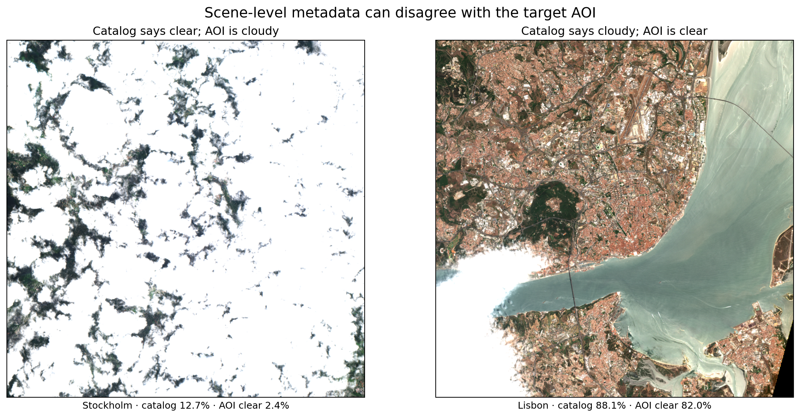

# open-revisit

From nominal revisit to useful observation: an open, reproducible case study of
Sentinel-2 observation availability.

## Question

How long does a user actually wait for a sufficiently clear Sentinel-2
observation, rather than merely for the next catalog acquisition? This case
study measures that difference for 20 European city AOIs from 2022-01-01
through 2025-12-31.

This is **not novel research**. It is a compact, reproducible implementation of
an established observation-availability question. Prior work includes
[Sudmanns et al. (2020)](https://doi.org/10.1080/17538947.2019.1572799) on
global Sentinel-2 coverage and availability, and
[Lewińska et al. (2024)](https://doi.org/10.1016/j.dib.2024.111054) on globally
usable Landsat and Sentinel-2 observations. The contribution here is the open
pipeline, explicit metric contract, and a small European case study—not a new
scientific method.

## Headline result

Across the 20 AOIs, the median of the AOI-level nominal median revisit was
**1.99 days**, while the median effective revisit after applying the usability
criteria was **5.00 days**: **2.51× longer**. The effective AOI medians ranged
from **3.01 to 15.00 days**. Of 12,172 complete observations, 2,469 were usable
(**20.3%**); the median AOI usable rate was **18.2%**, and the median AOI
probability of a usable observation within seven days was **40.1%**.

“Nominal” uses every complete acquisition. “Effective” uses only complete
observations with at least 95% AOI coverage and at least 80% clear area. Values
in prose and tables display days to two decimals and rates to one decimal place;
the Parquet system of record retains full fractional-day and floating-point
precision.



The five-day line is the platform-level reference, not a promise for an
individual AOI. Orbit overlap can make nominal acquisition intervals shorter,
while cloud, snow, shadow, and incomplete coverage make the effective interval
longer.



Seasonality is pronounced, particularly at high latitude. Each heatmap cell is
the probability that a daily start time in that month is followed by a usable
observation within seven days.



The survival curves show the probability that the wait exceeds each number of
days. The six AOIs are selected deterministically as best, worst, and four
quantile representatives by effective median revisit.



## Catalog filtering

At the common catalog cloud-cover threshold of 20%, the pooled result was
1,922 true positives, 772 false positives, 547 false negatives, and 8,931 true
negatives. Precision was **71.3%** and recall **77.8%**: **28.7%** of retained
observations were unusable, while **22.2%** of actually usable observations
were discarded. Catalog metadata and pixel-derived SCL are both imperfect
signals; this comparison does not treat either one as ground truth.



## Service levels and examples

The service-level curve answers a rolling-window question: for a requirement of
one usable observation every *W* days, what fraction of daily starts succeeds?
Thin lines are individual AOIs and the bold line is their median.



The two RGB chips are selected automatically from the threshold-20
misclassifications: the strongest example where the catalog says clear but the
AOI is cloudy, and the strongest example where the catalog says cloudy but the
AOI is clear. Each chip composites all visual assets in that datatake on the
same AOI grid used by the analysis.



## AOI summary

| AOI | Observations | Usable | Usable rate | Nominal median (d) | Effective median (d) | P(within 7d) | Longest outage (d) |
| --- | ---: | ---: | ---: | ---: | ---: | ---: | ---: |
| Amsterdam | 643 | 46 | 7.2% | 1.99 | 15.00 | 19.3% | 133.00 |
| Athens | 325 | 159 | 48.9% | 5.00 | 5.00 | 59.7% | 80.00 |
| Berlin | 647 | 125 | 19.3% | 1.99 | 5.00 | 41.1% | 85.00 |
| Copenhagen | 651 | 111 | 17.1% | 1.99 | 6.99 | 38.4% | 66.99 |
| Dublin | 643 | 56 | 8.7% | 1.99 | 11.01 | 20.3% | 110.00 |
| Hamburg | 646 | 61 | 9.4% | 1.99 | 10.00 | 25.1% | 235.00 |
| Innsbruck | 643 | 79 | 12.3% | 1.99 | 5.00 | 25.2% | 265.00 |
| Lisbon | 650 | 265 | 40.8% | 1.99 | 3.01 | 69.5% | 40.00 |
| London | 651 | 89 | 13.7% | 1.99 | 10.00 | 30.8% | 108.01 |
| Madrid | 650 | 317 | 48.8% | 1.99 | 3.01 | 77.4% | 40.00 |
| Marseille | 649 | 163 | 25.1% | 1.99 | 5.00 | 61.5% | 62.00 |
| Munich | 641 | 147 | 22.9% | 1.99 | 5.00 | 46.4% | 86.99 |
| Oslo | 595 | 91 | 15.3% | 1.99 | 7.50 | 32.9% | 173.01 |
| Paris | 652 | 135 | 20.7% | 1.99 | 5.00 | 43.2% | 81.99 |
| Reykjavík | 539 | 69 | 12.8% | 1.99 | 9.00 | 25.9% | 166.99 |
| Rome | 320 | 133 | 41.6% | 5.00 | 9.00 | 52.1% | 45.00 |
| Stockholm | 614 | 103 | 16.8% | 1.99 | 6.99 | 39.2% | 140.00 |
| Tromsø | 723 | 51 | 7.1% | 1.99 | 5.00 | 16.4% | 300.00 |
| Warsaw | 639 | 128 | 20.0% | 1.99 | 5.00 | 41.4% | 121.99 |
| Zürich | 651 | 141 | 21.7% | 1.99 | 5.00 | 43.5% | 106.99 |

The generated table is also available at
[`reports/tables/aoi_summary.md`](reports/tables/aoi_summary.md).

## Method

The pipeline queries the Earth Search Sentinel-2 L2A collection, intersects
scenes with each AOI, and reads the SCL band. It groups scenes by
`s2:datatake_id`—never by calendar date—because adjacent Sentinel-2 tiles from
one acquisition are one physical observation. All member scenes are
reprojected and composited before classification on a deterministic, per-AOI
20 m UTM analysis grid. Fractions use every pixel in the full AOI as the
denominator; they are never averages of per-scene fractions.

An observation is usable when `covered_fraction >= 0.95` and
`clear_fraction >= 0.80`. Incomplete observations are excluded from all
metrics, including catalog-filter evaluation. The nominal timeline contains all
complete observations; the effective timeline contains only complete, usable
observations. Definitions, denominators, censoring, and boundary behavior are
specified in [`docs/METRICS.md`](docs/METRICS.md).

The completed run used config hash
`f33bae2b5ac9c19b740d210280ef6a5c5530032aec054366ebc2f4e943f5dab7`,
took 4,154.83 seconds, and accounted for 18,072,864,400 bytes. Its resolved
configuration, versions, stage counts, timing, and byte-accounting method are
recorded in
[`data/runs/20260821T160550.807454Z_f33bae2b5ac9c19b740d210280ef6a5c5530032aec054366ebc2f4e943f5dab7.json`](data/runs/20260821T160550.807454Z_f33bae2b5ac9c19b740d210280ef6a5c5530032aec054366ebc2f4e943f5dab7.json).

## Reproduce in three commands

From a clean clone with Python 3.12, internet access, and sufficient disk space:

```console
uv sync --frozen
uv run open-revisit aois build aois/centroids.csv
uv run open-revisit run --config config/default.yaml
```

The run is incremental and idempotent. Discovery overlaps its stored watermark
by seven days to catch late-published or reprocessed items, then applies the
documented deduplication rule. Repeating a completed stage adds no rows for
unchanged input and configuration.

## Limitations

- SCL misses thin cloud and haze, can over-detect cloud on snow, sand, and
  bright urban roofs, and can misclassify water or shadow. These are SCL-defined
  availability statistics, not ground truth; catalog metadata and SCL are both
  imperfect signals.
- High-latitude AOIs such as Tromsø and Reykjavík receive extra nominal
  acquisitions from orbit overlap, while polar night drives usable optical
  availability toward zero in winter. Both effects are physical features of
  the result.
- Processing-baseline changes can alter SCL behavior. Starting in 2022 limits
  the study to baseline 04.00 and later, and `processing_baseline` is retained
  for stratified checks.
- Late-published and reprocessed items are handled with a watermark overlap and
  deterministic deduplication, but remain dependent on upstream catalog state.
- Earth Search sometimes omits `s2:*` metadata fields; these fields are nullable
  rather than imputed.
- Fractions use the full AOI denominator. Partial tile coverage therefore lowers
  `clear_fraction` by design; `min_coverage` separates insufficient coverage
  from cloudiness.
- Eighteen catalog scenes in this run referenced unavailable SCL assets,
  producing 12 incomplete observations. They are recorded rather than silently
  dropped and are excluded from every metric.

## Development

Run the offline quality gate with:

```console
make check
```

The project uses Python 3.12, `uv`, a `src` layout, typed pure metric functions,
Parquet as the system of record, and DuckDB as the query layer. The full design
and milestone contract are in [`docs/SPEC.md`](docs/SPEC.md).
